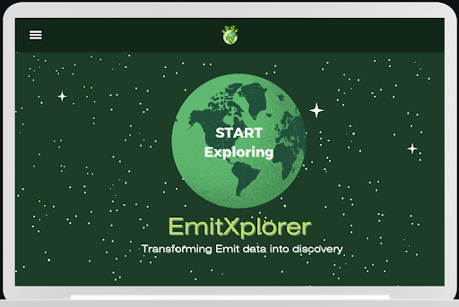
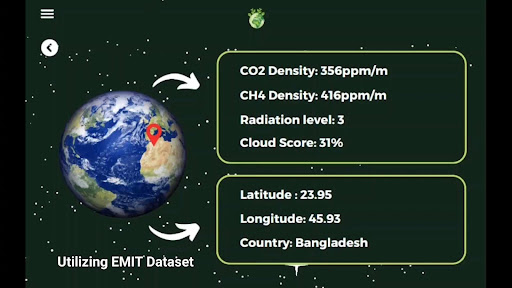
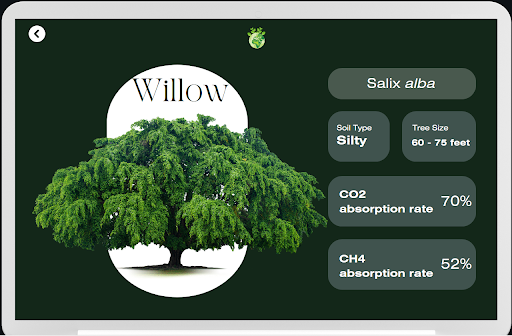
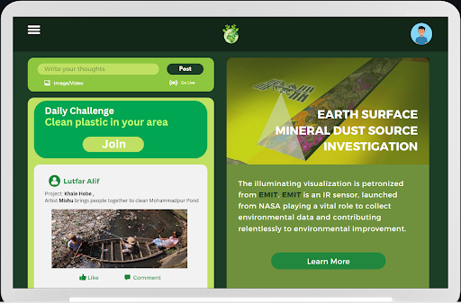
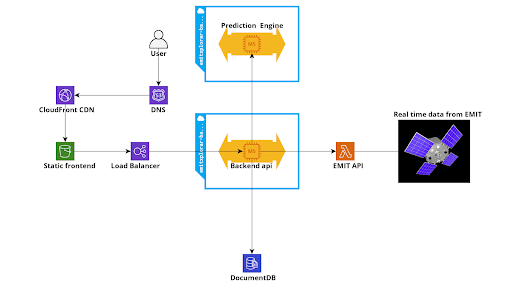

# EmitXplorer-Nasa-Space-App-Challenge
The project EmitXplorer is submitted by the Team - 'The Rocketeers' for the NASA Space Apps Challenge 2023.

# Emit Explorer - Project Demo

Explore the Emit Explorer project by interacting with our interactive prototype on Canva:

[Project Demo](https://www.canva.com/design/DAFtcDT5vuo/_qTzTfKTLVrzLqBwtUn9Zg/view?mode=prototype#sidebar)

## Introduction

Emit Explorer is a web application developed to address the critical issue of greenhouse gas concentration levels and environmental awareness. We have designed this application to cater to users of all age groups, providing an interactive platform for learning about social responsibilities and environmental risk factors through gamified actions. Emit Explorer empowers users to visualize, understand, and contribute to a cleaner, healthier world.



## Key Features

### Geospatial Gas Level Prediction

Emit Explorer offers users the ability to input specific date, latitude, and longitude values to obtain predictions for greenhouse gas levels, including CO2, O3, O2, and SO2 at their chosen location on the given date.

### Interactive Map Interface

Our application provides an interactive map interface that allows users to select their desired location by clicking on the map or entering latitude and longitude coordinates. This feature enhances user engagement and makes it easy to explore pollution data globally.

### Real-time, Historical, Prediction Data

Once a location is selected, Emit Explorer provides users with access to real-time and historical data on CO2, O3, and methane concentration levels. Users can choose to view the raw data or a simplified version that includes danger level indicators.

### Danger Level Prediction

Emit Explorer utilizes historical and prediction data to estimate the danger level of pollution at a selected location. This estimation includes a time limit prediction, helping users understand the potential environmental risks they may face.



### Tree-pedia

Emit Explorer includes a "Tree-pedia" section that offers interactive information about various trees and their significance in environmental restoration. Users can access essential details about trees that thrive in their selected region.



### Social Media Integration

Our application encourages active contributions to the environment by providing a social media-like blog post section. Users can post and share their environmental efforts and engage with a community of like-minded individuals. A leaderboard ranks users based on their environmental contributions.

### Awareness About the EMIT Project

Emit Explorer dedicated a page to provide users with the latest updates about NASA's EMIT project. This feature offers insights into the project's goals, progress, and potential applications of the data collected by EMIT.



## Infrastructure



## Installation
setup instructions for the Emit Explorer project:

## Backend Setup

1. **Microsoft .NET**:
   - Follow the installation guide for [.NET](https://dotnet.microsoft.com/download) to install the .NET SDK if you haven't already.

2. **Python FastAPI**:
   - Install Python (if not already installed): [Python Installation Guide](https://www.python.org/downloads/)
   - Install FastAPI using pip: `pip install fastapi`

3. **Navigate to the `backend` folder**:
   - Open your command line or terminal.
   - Change the directory to the `backend` folder of the Emit Explorer project by using the `cd` command: `cd path/to/backend`

4. **Build and Run the Backend API**:
   - Build and run the backend API by executing the appropriate commands (this may vary depending on your project structure and .NET version):
     ```bash
     dotnet build
     dotnet run
     ```

## Frontend Setup

1. **Node.js and npm**:
   - If you haven't already, install Node.js and npm by following the instructions in the [Node.js Installation Guide](https://nodejs.org/en/download/).

2. **Navigate to the `frontend` folder**:
   - Open your command line or terminal.
   - Change the directory to the `frontend` folder of the Emit Explorer project by using the `cd` command: `cd path/to/frontend`

3. **Install Frontend Dependencies**:
   - Run the following command to install the necessary frontend dependencies using npm:
     ```bash
     npm install
     ```


# Emit Explorer - Team Info

Meet the dedicated team behind Emit Explorer:

## The Rocketeers

### Samiha Tahsin Noshin
- **Role**: Team Lead
- **Email**: bsse1107@iit.du.ac.bd

### Abu Jafar Saifullah
- **Role**: Backend Developer
- **Email**: bsse1109@iit.du.ac.bd

### Kazi Muktadir Ahmed
- **Role**: Machine Learning Expert
- **Email**: bsse1111@iit.du.ac.bd

### Lutfar Rahman Alif
- **Role**: UI/UX Designer
- **Email**: bsse1120@iit.du.ac.bd

### Tasmia Zerin
- **Role**: Frontend Developer
- **Email**: bsse1128@iit.du.ac.bd

## Contact Us

If you have any questions, suggestions, or would like to get in touch with our team, feel free to reach out to us via email.


These instructions should help you set up the Emit Explorer project successfully. If you encounter any issues or have further questions, please don't hesitate to ask.

Thank you for joining us on this journey to combat pollution and create a cleaner, healthier world with Emit Explorer! 🌍🚀 #EmitExplorer #CleanerPlanet
